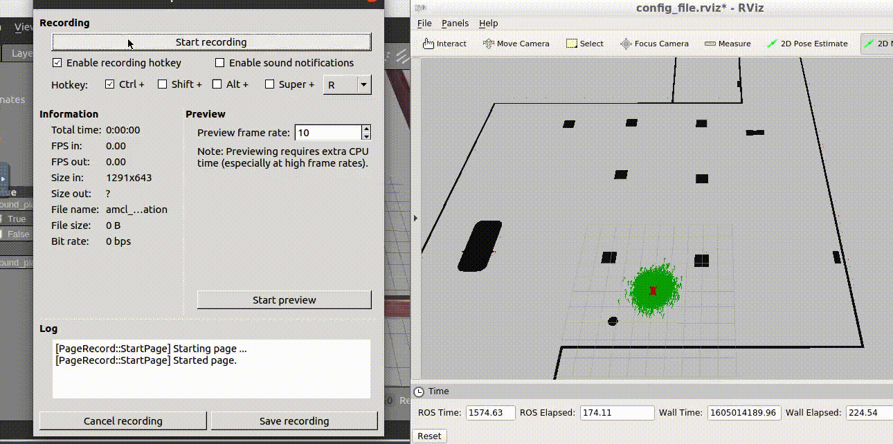

# ACML localization
The package my robot lauches the acml node. After which using move_base (2d nav goal) the required localization results were acheived.
This is an excercise as a part of the Udacity Robotics Software Engineer Nano degree.

# Demo 



# Usage 

Install the required dependencies as shown below :

```bash
$ sudo apt-get install ros-kinetic-navigation
$ sudo apt-get install ros-kinetic-map-server
$ sudo apt-get install ros-kinetic-move-base
$ sudo apt-get install ros-kinetic-amcl
```

Catkin make the this repo and launch it as shown:

```bash
roslaunch my_robot amcl.launch
```
